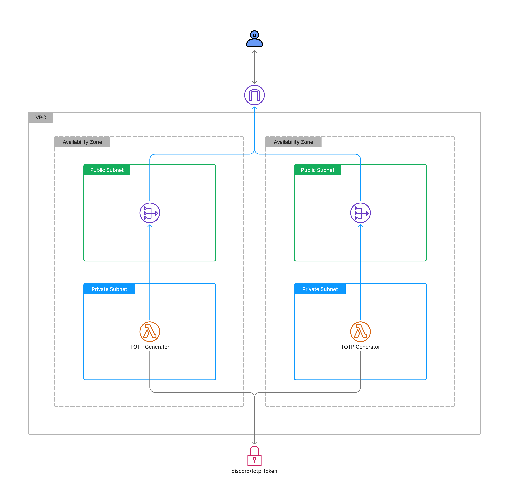
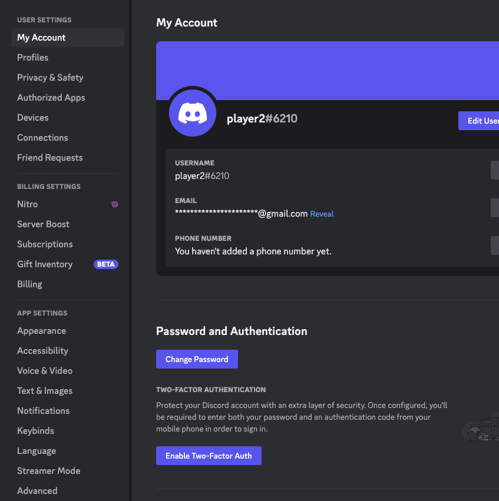
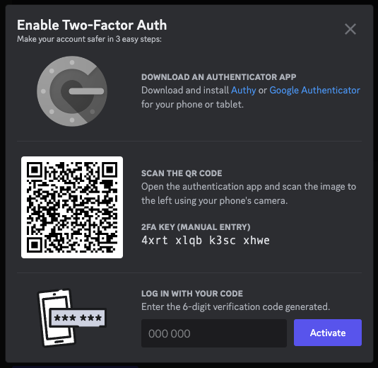
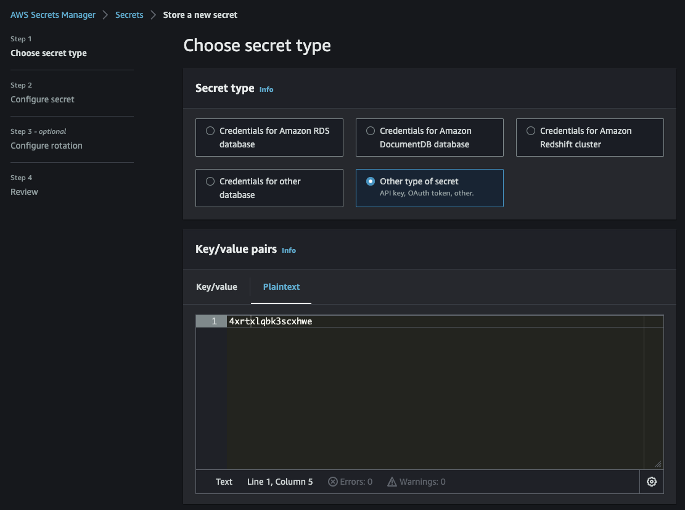
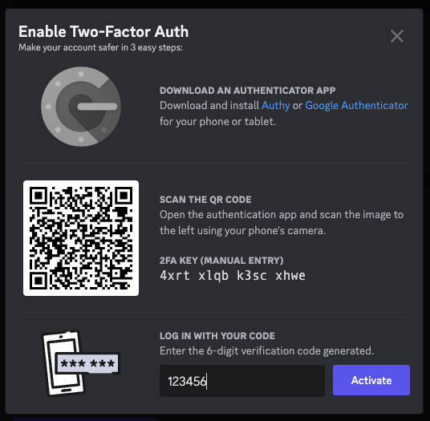

# AWS TOTP Function

This project creates a Lambda Function that expects a secret in [AWS SecretsManager](https://docs.aws.amazon.com/secretsmanager/latest/userguide/intro.html) as `provider/discord/totp-key`. Calling the Lambda Function produces a time-based one-time (TOTP) password to use to login to your Discord.



## Getting Started

1. In Discord, navigate to "User Settings" > "Account" and select "Enable 2FA"
   
   
2. Copy the server key from the "Enable 2FA" modal
3. Navigate to the [AWS Console](https://console.aws.amazon.com/)
4. Go to [AWS Secrets Manager](https://console.aws.amazon.com/secretsmanager/)
5. Create a new secret by selecting "Store a new secret"
   1. For "Secret Type", choose "Other type of secret"
   2. For "Key/Value Pairs", select "Plaintext" and paste the server key _without any spaces_
      
6. Select "Next" and give it the name `provider/discord/totp-key` (though this can be named however you please and can be changed by passing a `secret` context key to CDK)
7. Download this repository
8. Install dependencies with `pnpm install`
9. Deploy to your AWS account with `pnpm cdk deploy`
   1. If you chose to name the secret something different, pass a context key
   ```console
   pnpm cdk deploy -c secret=provider/discord/totp-key
   ```
10. Navigate to the AWS Lambda console and invoke the newly created Lambda function, `TotpFunction`
11. Copy the returned 6-digit code and paste into Discord, then select "Activate"
    
12. Success! 🎉
